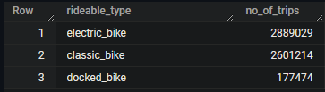

# Google-Data-Analytics-Capstone-Cyclistic-Case-Study

**Course:** [Google Data Analytics Capstone: Complete a Case Study](#)

## Introduction

In this case study, I will perform many real-world tasks of a junior data analyst at a fictional company, Cyclistic. In order to answer the key business questions, I will follow the steps of the data analysis process: **Ask**, **Prepare**, **Process**, **Analyze**, **Share**, and **Act**.

## Quick links:

**Data Source:** [divvy_tripdata](#) [accessed on 07/10/25]

**SQL Queries:**
1. [Data Combining](Data%20Combining.sql)
2. [Data Exploration](Data%20Exploration.sql)
3. [Data Cleaning](Data%20Cleaning.sql)
4. [Data Analysis](Data%20Analysis.sql)

**Data Visualizations:** [Tableau](#)

## Background

### Cyclistic

A bike-share program that features more than 5,800 bicycles and 600 docking stations. Cyclistic sets itself apart by also offering reclining bikes, hand tricycles, and cargo bikes, making bike-share more inclusive to people with disabilities and riders who can’t use a standard two-wheeled bike. The majority of riders opt for traditional bikes; about 8% of riders use the assistive options. Cyclistic users are more likely to ride for leisure, but about 30% use them to commute to work each day.

Until now, Cyclistic’s marketing strategy relied on building general awareness and appealing to broad consumer segments. One approach that helped make these things possible was the flexibility of its pricing plans: single-ride passes, full-day passes, and annual memberships. Customers who purchase single-ride or full-day passes are referred to as casual riders. Customers who purchase annual memberships are Cyclistic members.

Cyclistic’s finance analysts have concluded that annual members are much more profitable than casual riders. Although the pricing flexibility helps Cyclistic attract more customers, Moreno (the director of marketing and my manager) believes that maximizing the number of annual members will be key to future growth. Rather than creating a marketing campaign that targets all-new customers, Moreno believes there is a very good chance to convert casual riders into members. She notes that casual riders are already aware of the Cyclistic program and have chosen Cyclistic for their mobility needs.

Moreno has set a clear goal: Design marketing strategies aimed at converting casual riders into annual members. In order to do that, however, the marketing analyst team needs to better understand how annual members and casual riders differ, why casual riders would buy a membership, and how digital media could affect their marketing tactics. Moreno and her team are interested in analyzing the Cyclistic historical bike trip data to identify trends.

### Scenario

I am assuming to be a junior data analyst working in the marketing analyst team at Cyclistic, a bike-share company in Chicago. The director of marketing believes the company’s future success depends on maximizing the number of annual memberships. Therefore, my team wants to understand how casual riders and annual members use Cyclistic bikes differently. From these insights, my team will design a new marketing strategy to convert casual riders into annual members. But first, Cyclistic executives must approve our recommendations, so they must be backed up with compelling data insights and professional data visualizations.

## 1. Ask

### Business Task

The primary business task is to analyze how casual riders and annual members use Cyclistic bikes differently to inform the creation of a new marketing campaign aimed at converting casual riders to members.

### Analysis Questions
As per the project brief, three questions guide this initiative:

1. How do annual members and casual riders use Cyclistic bikes differently? 

2. Why would casual riders buy Cyclistic annual memberships? 

3. How can Cyclistic use digital media to influence casual riders to become members? 

My assignment from Moreno is to focus on answering the first question: How do annual members and casual riders use Cyclistic bikes differently?

## 2. Prepare

I will analyse and discover trends in Cyclistic's historical trip data from January 2022 to December 2022, which can be accessed from [divvy_tripdata](https://divvy-tripdata.s3.amazonaws.com/index.html). Motivate International Inc. has made the data available under this [license](https://divvybikes.com/data-license-agreement).

This is open data that may be used to investigate how various consumer categories use Cyclistic bikes. However, due to data privacy concerns, the use of riders' personally identifiable information is prohibited. This implies that we won't be able to associate pass purchases with credit card numbers to establish whether casual riders live in the Cyclistic service region or have purchased multiple single passes.

### Data Organization

There are 12 files with naming convention of **YYYYMM-divvy-tripdata** and each file includes information for one month, such as the ride id, bike type, start time, end time, start station, end station, start location, end location, and whether the rider is a member or not. The corresponding column names are ride_id, rideable_type, started_at, ended_at, start_station_name, start_station_id, end_station_name, end_station_id, start_lat, start_lng, end_lat, end_lng and member_casual.

## 3. Process

BigQuery is used to aggregate and clean many datasets.

**Reason:**
Microsoft Excel has a limit of 1,048,576 rows per worksheet due to its inability to handle huge data sets. Because the Cyclistic dataset contains over 5.6 million rows, a platform capable of handling large amounts of data, such as BigQuery, is required.

### Data Combining

SQL query: [Data Combining](Data%20Combining.sql)
The '2022_tripdata' dataset has 12 csv files supplied as tables. Another table called "combined_data" is created, including 5,667,717 rows of data for the full year.

### Data Exploration

SQL query: [Data Exploration](Data%20Exploration.sql)
Before cleansing the data, I'm familiarising myself with it to identify inconsistencies.

Observations:

1. The table below displays all column names and data types. The ride_id column is our primary key.

2. The following table shows number of null values in each column.

Note that some columns have same number of missing values. This may be due to missing information in the same row i.e. station's name and id for the same station and latitude and longitude for the same ending station.

3. As ride_id has no null values, let's use it to check for duplicates.

There are no duplicate rows in the data.

4. All ride_id values have a length of 16, thus there is no need to clean them.

5. The started_at and ended_at fields show the trip's start and end times in YYYY-MM-DD hh:mm:ss UTC format. To calculate the overall journey duration, a new column named ride_length can be established. There are 5360 journeys that last more than a day, and 122283 excursions that last less than a minute or have an end time that is earlier than the start time, thus they must be removed. Other columns, such as day_of_week and month, can be useful in analysing trips taken at different periods of year.

6. There are 833064 rows with both start_station_name and start_station_id missing, which must be eliminated.

7. A total of 892742 rows have both end_station_name and end_station_id missing, which must be eliminated.

8. There are 5858 rows with both end_lat and end_lng missing, which must be eliminated.

9. The member_casual column has two unique values: member and casual rider.

10. The columns start_station_id and end_station_id should be eliminated because they provide no value to our present problem analysis. Longitude and latitude location columns may not be utilised for analysis, however they can be used to create a map.

### Data Cleaning

SQL Query: [Data Cleaning](Data%20Cleaning.sql)

1. All rows with missing values are deleted.
2. Three new columns are added: ride_length (travel duration), day_of_week, and month.
3. Trips lasting less than a minute and longer than a day are omitted.
4. This step removes a total of 1,375,912 rows.

## Analyze and Share

SQL Query: [Data Analysis](Data%20Analysis.sql)
Data Visualization: [Tableau](#)
The data is stored appropriately and is now prepared for analysis. I queried multiple relevant tables for the analysis and visualized them in Tableau.
The analysis question is: How do annual members and casual riders use Cyclistic bikes differently?

First of all, member and casual riders are compared by the type of bikes they are using.

(gambar)

Members account for 59.7% of the total, with casual riders making up the remaining 40.3%. Each bike type chart indicates a percentage of the total. The most popular bike is the classic bike, followed by the electric cycle. Docked bikes are utilised the least, by casual riders.

The number of journeys is then broken down by month, day of week, and hour of the day.

(gambar)

Months: When it comes to monthly trips, both casual and members have similar patterns, with more trips in the spring and summer and fewer in the winter.  The margin between casuals and members is narrowest in July during the summer.
Days of Week: When the days of the week are compared, it is observed that casual riders make more journeys on weekends, whereas members show a decrease over the weekend in comparison to the other days of the week.
Hours of the Day: The number of trips taken by members peaks twice during the day.  One is early in the morning, between 6 and 8 a.m., and the other is in the evening, between 4 and 8 p.m., while the number of trips for casual riders increases steadily throughout the day until evening and then decreases.

We can conclude from earlier data that members may use bikes to go to and from work during the week, whereas casual riders use bikes throughout the day, more frequently on weekends, for recreational purposes. Both are most active during the summer and spring.

The duration of the excursions is examined to determine the differences in behaviour between casual and member riders.

(gambar)

Take note that casual riders cycle for longer than members on average. The length of the average journey for members remains constant throughout the year, week, and day. However, the length of time that casual motorcyclists pedal varies. They travel more distances in the spring and summer, on weekends, and between 10 a.m. and 2 p.m. They make brief visits between 5 and 8 a.m.

These findings led to the conclusion that casual commuters travel longer (about twice as much) yet less frequently than members. They travel longer distances on weekends and throughout the day outside of commute hours, as well as during the spring and summer seasons, which could be for recreational purposes.

To further comprehend the distinctions between casual and member riders, the beginning and ending stations can be examined.  Stations with the most trips are considered utilising filters to arrive at the following result.

(gambar)

Casual riders frequently begin their trips at stations near museums, parks, beaches, harbour points, and aquariums, whereas members begin their journeys at stations near universities, residential areas, restaurants, hospitals, grocery stores, theatres, schools, banks, factories, train stations, parks, and plazas.

(gambar)

A similar pattern can be seen in the final station sites.  Casual riders finish their journey near parks, museums, and other recreational sites, whereas members finish near universities, residential, and commercial sectors.  This demonstrates that casual riders utilise bikes for leisure activities, whereas members rely heavily on them for everyday commutes.

Summary:
### Summary:

| Casual | Member |
| :--- | :--- |
| Prefer to use bikes throughout the day, particularly on weekends in the summer and spring for recreational activities. | In the summer and spring, I prefer to ride my bike on weekdays during commuting hours (8 a.m./5 p.m.) |
| Travel twice as long but less frequently than members. | Travel more frequently but on shorter rides (about half the duration of casual riders' trips). |
| Their travels begin and conclude near parks, museums, the coast, and other recreational destinations. | Their visits begin and terminate near universities, residential, and commercial districts. |

## Act

### Conclusion

The analysis reveals clear and distinct behavioral patterns between casual riders and annual members. Casual riders use the service for leisure—taking longer, less frequent trips, primarily on weekends from scenic locations. Annual members use the service for utility—taking shorter, more frequent trips on weekdays for commuting.

### Top Three Recommendations

Based on these findings, here are three recommendations to help convert casual riders into members:

Recommendation: **Create a "Weekend Pass" or a discounted weekend-only membership tier.**

Justification: *The data shows casual riders are most active on weekends. A lower-cost membership that offers benefits specifically for Saturday and Sunday could serve as an entry point, getting them accustomed to the benefits of being a member before committing to a full annual plan.*

Recommendation: **Launch targeted marketing campaigns highlighting the cost savings for commuters.**

Justification: *While members are already using bikes for commuting, casual riders may not be. Run digital ads or place physical ads near popular casual rider stations showing the cost of an annual membership compared to two single-ride passes per day. Frame it as "Your daily commute, for less than a cup of coffee."*

Recommendation: **Offer a "First-Time Member Discount" during peak season (Summer).**

Justification: *Both groups, especially casual riders, are most active in the summer. A promotional campaign from June to August that offers a discount (e.g., 25% off) on the first year of membership can capitalize on this high engagement and convert riders when they are using the service most.*
